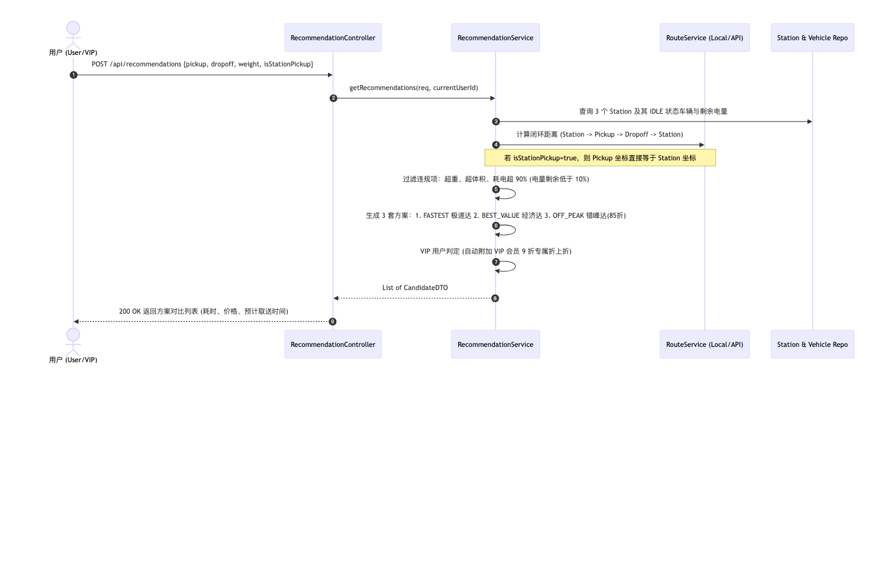
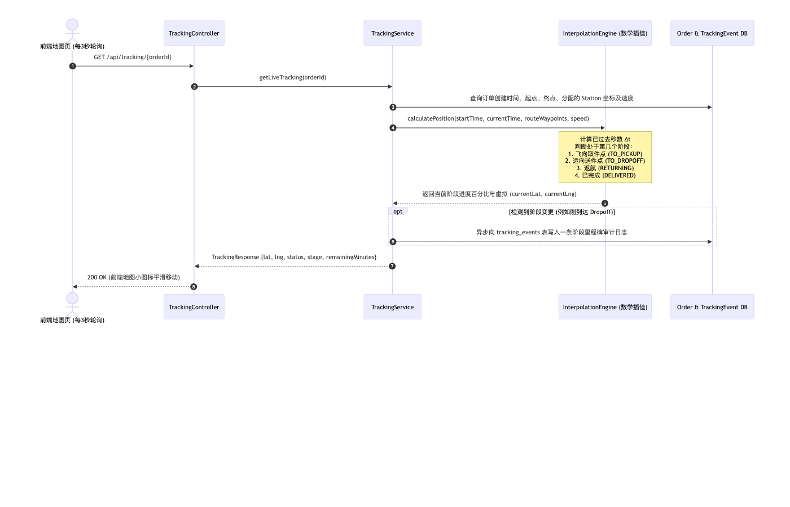
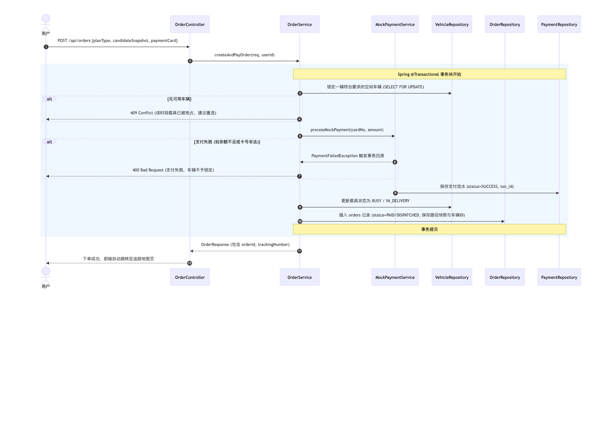
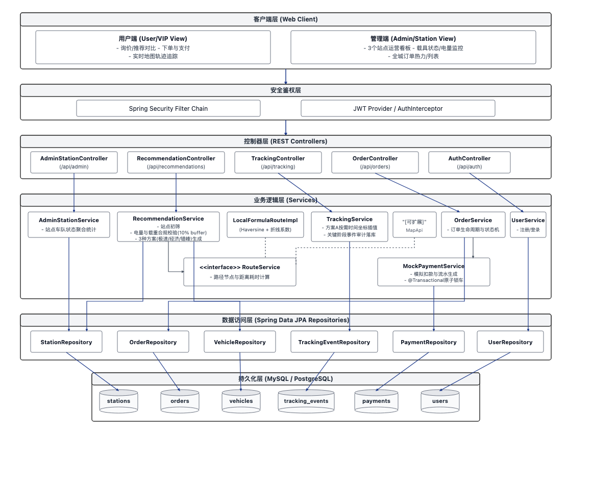
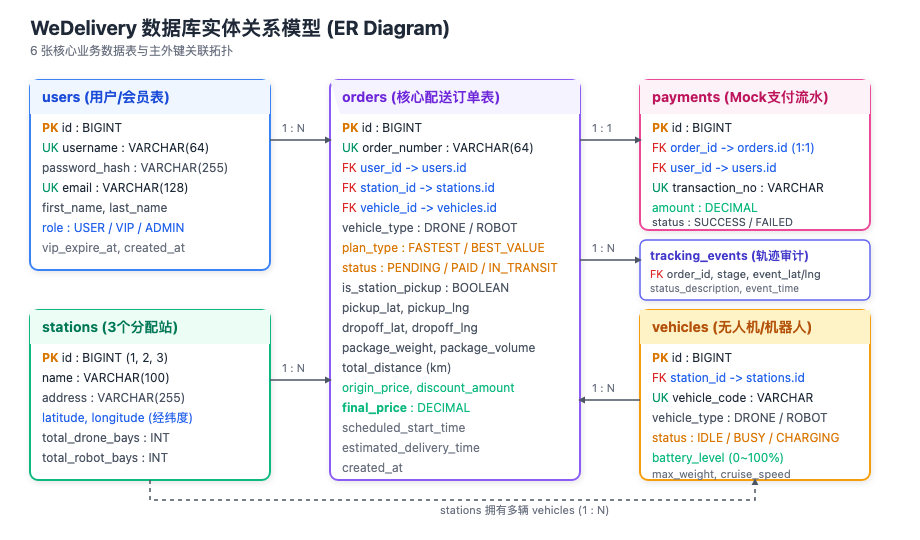

# WeDelivery 物流调度与配送管理系统架构与数据库设计说明书
> **项目代号**：Flag Camp Team 03 - Dispatch & Delivery Management App (WeDelivery)  
> **文档版本**：v1.0 (正式评审与归档版)  
> **适用范围**：团队技术评审、Google Docs 方案归档、前后端研发协同参考

---

## 1. 项目背景与核心业务场景

### 1.1 业务背景
WeDelivery 是一家服务于旧金山市内的智能无人化物流服务商。系统在旧金山市区内规划设立了 **3 个主要分配中心（Distribution Centers / Stations）**，利用**地面自主配送机器人（Ground Robots）**与**多旋翼配送无人机（Delivery Drones）**为个人及企业用户提供中小型包裹的即时递送服务。

### 1.2 核心业务闭环
整个系统涵盖端到端的全生命周期：
1. **询价与多方案对比**：用户输入取件、送件地址与包裹规格，系统在毫秒级内评估站点载具可用性与航程电量，返回“极速达”、“经济达”以及“错峰达”方案。
2. **锁车与交易支付**：用户选择心仪方案后提交支付。系统在同一个数据库事务内完成虚拟扣款校验、生成支付流水、将订单转为履约状态，并原子锁定对应站点的空闲载具。
3. **全流程履约与实时地图追踪**：用户进入追踪页面，系统基于数学插值模型动态推算载具当前经纬度并平滑移动，展示由“前往取件 → 取件中 → 配送中 → 返航中 → 已完成”的完整状态机变更。
4. **管理站控大盘**：管理员可实时查看 3 个站点的载具分布、运行状态、电量水平以及全城订单的履约效率。

---

## 2. 核心业务机制与算法设计

### 2.1 载具状态管理与能力约束模型

系统管理两类硬件载具：空中无人机（DRONE）与地面机器人（ROBOT）。

| 评估维度 | 空中无人机 (Drone) | 地面机器人 (Robot) |
| :--- | :--- | :--- |
| **优势特性** | 飞行不受地面路网拥堵限制、直线航程、速度极快 | 载重上限大、抗风雨扰动强、行驶成本低 |
| **巡航速度 (v)** | 40 ~ 50 km/h (系统默认按 45 km/h 计算) | 12 ~ 18 km/h (系统默认按 15 km/h 计算) |
| **载重上限 (W_max)** | ≤ 3.0 kg | ≤ 15.0 kg |
| **容积上限 (V_max)** | ≤ 0.05 m³ (约长宽高 40 × 35 × 35 cm) | ≤ 0.30 m³ |
| **单位能耗率 (r)** | 4.0% 电量 / km | 2.0% 电量 / km |

#### 载具四态状态机
1. **IDLE (空闲待命)**：停泊在指定站点的充电机舱，电量充足，可接单。
2. **IN_DELIVERY / BUSY (执行任务中)**：已绑定活跃订单，处于闭环航程中。
3. **CHARGING (回站充电中)**：任务执行完毕返回站点，电量低于安全线，自动进入充电序列。
4. **OFFLINE (离线维护)**：故障报修或人工停运。

---

### 2.2 闭环配送路径与 10% 电量安全冗余模型

为确保载具不仅能够送达包裹，还能顺利返航回收，系统采用**全闭环任务周期**进行校验。

#### 1. 统一闭环路径模型
- **标准上门取件模式 (Door-to-Door)**：  
  Station → 取件点 (Pickup) → 送件点 (Dropoff) → 返回 Station  
  全周期总里程：D_total = 距离(Station到Pickup) + 距离(Pickup到Dropoff) + 距离(Dropoff到Station)
- **站点自投模式 (Station Pickup)**：  
  用户直接将包裹送至最近站点，此时 取件点 = Station，首段距离为 0：  
  Station (直接取件) → 送件点 (Dropoff) → 返回 Station  
  全周期总里程：D_total = 距离(Station到Dropoff) + 距离(Dropoff到Station)  
  *(系统无需编写两套独立逻辑，直接将取件点坐标赋值为站点坐标即可无缝复用)*

#### 2. 电量安全冗余判定规则 (10% Buffer)
设载具当前电量为 B_current (0% ~ 100%)，包裹实际重量为 w (kg)：
1. **载重能耗加权系数**：加权系数 = 1 + (实际重量 / 最大载重) × 0.2
2. **全周期耗电预测值**：预测耗电 ΔB = 总里程 × 单位能耗率 × 载重加权系数
3. **准入判定方程**：  
   **ΔB ≤ 90%** 且 **当前电量 - 预测耗电 ≥ 10%**  
   若任一条件不满足，系统判定该载具电量不足以完成任务，不予派单。

---

### 2.3 路径距离与时间估算模型 (RouteService 解耦)

为了实现“当前无外部依赖极速启动，后续可平滑插拔接入 Google Maps / Mapbox API”，在代码架构上采用**策略模式**定义 RouteService 接口：

1. **空中无人机距离 (直线球面大圆距离)**：  
   使用标准的 Haversine 球面距离公式计算经纬度两点间的米级直线飞行距离。
2. **地面机器人距离 (地面路网折线估算)**：  
   旧金山市区多为棋盘格街道，地面行驶受单行道、红绿灯与建筑物阻隔，采用曼哈顿折线系数加权：  
   地面行驶距离 = 直线距离 × 1.35  
   *(当后续启用 MapApiRouteImpl 时，可直接向 Mapbox Directions API 发送请求获取真实道路拓扑和转弯节点)*。

---

### 2.4 三方案智能推荐引擎（极速 / 经济 / 错峰）




后端接收到发件需求后，同时评估 3 个站点的车辆与航程，输出 3 种用户可选方案：

1. **方案一：Fastest (无人机极速达)**
   - 准入：重量 ≤ 3 kg 且 体积 ≤ 0.05 m³ 且有满足电量的空闲无人机。
   - 计价模型：基础运费 $15.00 + 里程费 $1.80/km + 重量费 $2.00/kg。
2. **方案二：Best Value (地面机器人经济达)**
   - 准入：重量 ≤ 15 kg 且 体积 ≤ 0.30 m³ 且有满足电量的空闲机器人。
   - 计价模型：基础运费 $6.00 + 里程费 $0.90/km + 重量费 $0.80/kg。
3. **方案三：Off-Peak Eco (错峰低碳延时方案)**
   - 规则：系统推荐将取件计划延后至下一个整点（如 1 小时后），以平衡站点的高峰调度负荷。
   - 优惠：在原方案价格基础上享受 **15% 折扣 (85折)**。
4. **VIP 叠加优惠**：若当前用户为 VIP 角色，系统在任何方案结账时**额外自动追加 9 折会员专享折上折**。

---

### 2.5 虚拟 GPS 轨迹推进引擎 (方案 A 按需数学插值)




在没有硬件 GPS 的情况下，采用轻量、高效且平滑的方案 A：
1. **运行机理**：前端地图页面每隔 3 秒请求一次跟踪接口 `GET /api/tracking/{orderId}`。后端通过当前系统时间与任务启动时间的物理时间差，推导出载具所处的空间阶段与精确经纬度。
2. **三段式阶段推进**：
   - 阶段 1：飞向取件点 (TO_PICKUP)
   - 阶段 2：运向送件点 (TO_DROPOFF)
   - 阶段 3：返航回站 (RETURNING)
   - 阶段 4：已完成 (COMPLETED)
3. **关键事件落库**：当载具跨越关键阶段节点时，后端自动向 `tracking_events` 写入一条状态里程碑记录（如“已成功取件，正在送往目的地”），兼顾实时插值的高性能与履约历史的审计需求。

---

### 2.6 轻量 Mock 支付事务与原子锁车 (@Transactional)




为了还原真实的工业级交易闭环，同时避免因对接第三方银行网关带来的配置复杂性：
1. **扣款规则 Mock**：正常卡号扣款成功，生成唯一流水号 `TXN-MOCK-xxxxxxxx`；卡号以 `0000` 结尾时模拟银行卡余额不足，抛出异常。
2. **Spring 声明式事务一致性保证**：
   - 使用 `@Transactional(rollbackFor = Exception.class)`。
   - 下单时使用悲观锁 `SELECT ... FOR UPDATE` 锁定一辆满足条件的可用车辆。
   - 扣款成功后，载具状态修改为 `BUSY`，订单状态变更为 `PAID`。
   - 若支付失败，事务整体回滚，载具不被锁定，订单不虚假创建。

---

### 2.7 三级用户角色与权限体系

- **普通用户 (USER)**：标准运费与服务计价，正常排队调度。
- **VIP 会员 (VIP)**：全单专享 9 折折上折，重量/体积上限宽免 10%，优先调度高电量载具。
- **运营管理员 (ADMIN)**：拥有专属 Admin Dashboard，查看 3 个站点实时载具数量分布与电量热度图，查看全城订单履约监控与异常干预。

---

## 3. 系统整体架构设计

### 3.1 系统分层架构图



系统由客户端层、安全鉴权层、Spring Boot REST 控制器层、业务逻辑层（推荐/路线/支付/追踪）、Spring Data JPA 数据持久层以及 MySQL 关系型数据库组成，分层清晰，职责单一。

---

## 4. 完整数据库设计规范 (Schema Design)

### 4.1 实体关系模型 (ER Diagram)



---

### 4.2 核心数据表结构字典

#### 表 1：用户表 users
存储普通注册用户、VIP 会员身份与后台管理员账号。

| 字段名 | 数据类型 | 允许空 | 默认值 | 约束 / 索引 | 业务说明 |
| :--- | :--- | :---: | :---: | :---: | :--- |
| id | BIGINT | 否 | 自增 | 主键 (PRIMARY KEY) | 用户唯一 ID |
| username | VARCHAR(64) | 否 | | 唯一索引 (UNIQUE) | 登录账号 |
| password_hash | VARCHAR(255) | 否 | | | BCrypt 加密存储的密码散列值 |
| email | VARCHAR(128) | 否 | | 唯一索引 (UNIQUE) | 电子邮箱 |
| first_name | VARCHAR(64) | 是 | NULL | | 用户名 |
| last_name | VARCHAR(64) | 是 | NULL | | 用户姓 |
| role | VARCHAR(20) | 否 | 'USER' | 普通索引 | 权限角色：USER, VIP, ADMIN |
| vip_expire_at | DATETIME | 是 | NULL | | VIP 会员到期时间 |
| created_at | DATETIME | 否 | 当前时间 | | 账号创建时间 |
| updated_at | DATETIME | 否 | 当前时间 | | 最后修改时间 |

---

#### 表 2：配送分配站表 stations
存储旧金山市内的 3 个核心配送中心物理坐标与停机/充电泊位规模。

| 字段名 | 数据类型 | 允许空 | 默认值 | 约束 / 索引 | 业务说明 |
| :--- | :--- | :---: | :---: | :---: | :--- |
| id | BIGINT | 否 | 自增 | 主键 (PRIMARY KEY) | 站点编号（1: Downtown, 2: Sunset, 3: Mission） |
| name | VARCHAR(100) | 否 | | | 站点显示名称 |
| address | VARCHAR(255) | 否 | | | 物理门牌地址 |
| latitude | DECIMAL(10, 7) | 否 | | | 站点所在纬度 (例如 37.7891720) |
| longitude | DECIMAL(10, 7) | 否 | | | 站点所在经度 (例如 -122.3970420) |
| total_drone_bays | INT | 否 | 10 | | 无人机起降坪位总容量 |
| total_robot_bays | INT | 否 | 15 | | 地面机器人充电泊位总容量 |
| contact_phone | VARCHAR(32) | 是 | NULL | | 站点联系电话 |

---

#### 表 3：配送载具表 vehicles
维护归属于各个站点的无人机与地面机器人的实时运行状态、续航电量与硬件能力。

| 字段名 | 数据类型 | 允许空 | 默认值 | 约束 / 索引 | 业务说明 |
| :--- | :--- | :---: | :---: | :---: | :--- |
| id | BIGINT | 否 | 自增 | 主键 (PRIMARY KEY) | 载具唯一 ID |
| station_id | BIGINT | 否 | | 外键 (FK -> stations.id) | 当前归属分配站 ID |
| vehicle_code | VARCHAR(32) | 否 | | 唯一索引 (UNIQUE) | 载具编号 (例如 DRONE-DT-01) |
| vehicle_type | VARCHAR(20) | 否 | | 普通索引 | 类型：DRONE (无人机), ROBOT (机器人) |
| status | VARCHAR(20) | 否 | 'IDLE' | 普通索引 | 状态：IDLE, BUSY, CHARGING, OFFLINE |
| battery_level | DECIMAL(5, 2) | 否 | 100.00 | | 当前剩余电量百分比 (0.00 ~ 100.00) |
| max_weight | DECIMAL(5, 2) | 否 | | | 最大载重 (kg) |
| max_volume | DECIMAL(5, 2) | 否 | | | 最大体积容积 (m³) |
| cruise_speed | DECIMAL(5, 2) | 否 | | | 巡航速度 (km/h) |
| updated_at | DATETIME | 否 | 当前时间 | | 状态最后上报时间 |

---

#### 表 4：配送订单表 orders
系统核心业务大表，保存完整的订单参数、计价快照、分配载具与履约时间戳。

| 字段名 | 数据类型 | 允许空 | 默认值 | 约束 / 索引 | 业务说明 |
| :--- | :--- | :---: | :---: | :---: | :--- |
| id | BIGINT | 否 | 自增 | 主键 (PRIMARY KEY) | 订单主键 ID |
| order_number | VARCHAR(64) | 否 | | 唯一索引 (UNIQUE) | 外部可见追踪单号 (如 SFORD202609230001) |
| user_id | BIGINT | 否 | | 外键 (FK -> users.id) | 下单用户 ID |
| station_id | BIGINT | 否 | | 外键 (FK -> stations.id) | 负责发件履约的分配站 ID |
| vehicle_id | BIGINT | 是 | NULL | 外键 (FK -> vehicles.id) | 实际锁定的运载工具 ID |
| vehicle_type | VARCHAR(20) | 否 | | | 履约方式：DRONE 或 ROBOT |
| plan_type | VARCHAR(20) | 否 | | | 方案：FASTEST, BEST_VALUE, OFF_PEAK |
| status | VARCHAR(32) | 否 | 'PENDING_PAYMENT' | 普通索引 | 状态机 (详见下文定义) |
| is_station_pickup | BOOLEAN | 否 | FALSE | | 是否站点自投 (true 省去取件航段) |
| pickup_address | VARCHAR(255) | 否 | | | 取件物理地址描述 |
| pickup_lat | DECIMAL(10, 7) | 否 | | | 取件纬度 |
| pickup_lng | DECIMAL(10, 7) | 否 | | | 取件经度 |
| dropoff_address | VARCHAR(255) | 否 | | | 送达物理地址描述 |
| dropoff_lat | DECIMAL(10, 7) | 否 | | | 送达纬度 |
| dropoff_lng | DECIMAL(10, 7) | 否 | | | 送达经度 |
| package_weight | DECIMAL(5, 2) | 否 | | | 物品重量 (kg) |
| package_volume | DECIMAL(5, 2) | 否 | | | 物品体积 (m³) |
| total_distance | DECIMAL(8, 2) | 否 | | | 全闭环估算总里程 (km) |
| origin_price | DECIMAL(10, 2) | 否 | | | 方案原始标价 (美元) |
| discount_amount | DECIMAL(10, 2) | 否 | 0.00 | | 优惠抵扣额 (错峰折扣 + VIP 优惠) |
| final_price | DECIMAL(10, 2) | 否 | | | 实际应付/实付金额 |
| scheduled_start_time | DATETIME | 否 | | | 计划启动调度时间 (错峰方案延后) |
| estimated_delivery_time | DATETIME | 否 | | | 预计送达客户时间 |
| actual_delivery_time | DATETIME | 是 | NULL | | 实际标记完成送达的时间 |
| created_at | DATETIME | 否 | 当前时间 | | 订单创建时间 |

> **订单状态流转 (orders.status)**：  
> `PENDING_PAYMENT` (待支付) → `PAID` (已付款已锁车) → `PICKING_UP` (取件中) → `IN_TRANSIT` (送件配送中) → `DELIVERED` (已成功送达) → `CANCELLED` (已取消)

---

#### 表 5：支付流水表 payments
保存每一次支付扣款的凭证数据。

| 字段名 | 数据类型 | 允许空 | 默认值 | 约束 / 索引 | 业务说明 |
| :--- | :--- | :---: | :---: | :---: | :--- |
| id | BIGINT | 否 | 自增 | 主键 (PRIMARY KEY) | 支付记录 ID |
| order_id | BIGINT | 否 | | 唯一索引，外键 (FK) | 对应唯一的订单 ID (一对一) |
| user_id | BIGINT | 否 | | 外键 (FK -> users.id) | 付款人用户 ID |
| transaction_no | VARCHAR(64) | 否 | | 唯一索引 (UNIQUE) | 支付流水凭证号 (如 TXN-MOCK-98234821) |
| payment_method | VARCHAR(32) | 否 | 'MOCK_CARD' | | 支付途径：MOCK_CARD, STRIPE 等 |
| amount | DECIMAL(10, 2) | 否 | | | 实扣金额 |
| status | VARCHAR(20) | 否 | | 普通索引 | 状态：SUCCESS, FAILED |
| failure_code | VARCHAR(64) | 是 | NULL | | 失败错误码 (如 INSUFFICIENT_BALANCE) |
| paid_at | DATETIME | 否 | 当前时间 | | 扣款成功时间戳 |

---

#### 表 6：轨迹里程碑事件表 tracking_events
记录载具跨越关键物理节点时的审计日志，支撑前端展示“配送足迹时间轴”。

| 字段名 | 数据类型 | 允许空 | 默认值 | 约束 / 索引 | 业务说明 |
| :--- | :--- | :---: | :---: | :---: | :--- |
| id | BIGINT | 否 | 自增 | 主键 (PRIMARY KEY) | 事件主键 ID |
| order_id | BIGINT | 否 | | 外键索引 (FK -> orders.id) | 对应订单 ID |
| stage | VARCHAR(32) | 否 | | | 航段：TO_PICKUP, TO_DROPOFF, RETURNING, COMPLETED |
| status_description | VARCHAR(255) | 否 | | | 前端展示文案 (例如“无人机已抵达取件地，正在升空配送”) |
| event_lat | DECIMAL(10, 7) | 否 | | | 触发该事件时的纬度坐标 |
| event_lng | DECIMAL(10, 7) | 否 | | | 触发该事件时的经度坐标 |
| event_time | DATETIME | 否 | 当前时间 | | 事件发生时间戳 |

---

### 4.3 数据库种子数据 (Seed Data 初始化 SQL)

```sql
-- 1. 初始化 3 个旧金山核心分配站 (Distribution Centers)
INSERT INTO stations (id, name, address, latitude, longitude, total_drone_bays, total_robot_bays)
VALUES 
(1, 'Station 1 - SF Downtown Hub', '500 Howard St, San Francisco, CA 94105', 37.7891720, -122.3970420, 10, 15),
(2, 'Station 2 - Sunset District Hub', '1900 Irving St, San Francisco, CA 94122', 37.7638420, -122.4789120, 8, 12),
(3, 'Station 3 - Mission District Hub', '2400 Mission St, San Francisco, CA 94110', 37.7588920, -122.4191340, 10, 15);

-- 2. 初始化各站点示例载具 (Drones & Robots)
INSERT INTO vehicles (station_id, vehicle_code, vehicle_type, status, battery_level, max_weight, max_volume, cruise_speed)
VALUES 
(1, 'DRONE-DT-01', 'DRONE', 'IDLE', 100.00, 3.00, 0.05, 45.00),
(1, 'DRONE-DT-02', 'DRONE', 'IDLE', 95.00, 3.00, 0.05, 45.00),
(1, 'ROBOT-DT-01', 'ROBOT', 'IDLE', 100.00, 15.00, 0.30, 15.00),
(1, 'ROBOT-DT-02', 'ROBOT', 'IDLE', 88.00, 15.00, 0.30, 15.00),
(2, 'DRONE-SS-01', 'DRONE', 'IDLE', 100.00, 3.00, 0.05, 45.00),
(2, 'ROBOT-SS-01', 'ROBOT', 'IDLE', 92.00, 15.00, 0.30, 15.00),
(3, 'DRONE-MS-01', 'DRONE', 'IDLE', 100.00, 3.00, 0.05, 45.00),
(3, 'ROBOT-MS-01', 'ROBOT', 'IDLE', 96.00, 15.00, 0.30, 15.00);

-- 3. 初始化测试账号 (密码均为 raw: password123, 使用 BCrypt 编码)
INSERT INTO users (username, password_hash, email, first_name, last_name, role, vip_expire_at)
VALUES 
('admin', '$2a$10$78Kx0iE/K71rXk6oA2lQfeqG7q6L3C8WpB5o0M9v4bWzYw1mN5Y7G', 'admin@wedelivery.com', 'System', 'Admin', 'ADMIN', NULL),
('vip_user', '$2a$10$78Kx0iE/K71rXk6oA2lQfeqG7q6L3C8WpB5o0M9v4bWzYw1mN5Y7G', 'vip@gmail.com', 'Alice', 'Smith', 'VIP', '2027-12-31 23:59:59'),
('normal_user', '$2a$10$78Kx0iE/K71rXk6oA2lQfeqG7q6L3C8WpB5o0M9v4bWzYw1mN5Y7G', 'bob@gmail.com', 'Bob', 'Jones', 'USER', NULL);
```

---

## 5. 技术栈选型建议与团队开发里程碑

### 5.1 推荐现代化技术栈选型

| 模块类别 | 推荐技术栈 | 选型理由与核心优势 |
| :--- | :--- | :--- |
| **后端框架** | **Java 17/21 + Spring Boot 3.x** | 取代遗留项目老旧的 Spring MVC XML 配置，注解驱动开箱即用，代码量减少 60% |
| **持久层 ORM** | **Spring Data JPA (Hibernate)** | 极速生成基础 CRUD，配合 `@Transactional` 天然支持事务回滚与悲观锁 |
| **安全鉴权** | **Spring Security 6 + JWT** | 无状态 Token 交互，天然支持普通用户 / VIP / Admin 的角色拦截权限 |
| **前端框架** | **React 18 + TypeScript + Ant Design** | 组件库丰富，能极快搭建出高颜值的询价表单、卡片对比及 Admin 站控大盘 |
| **前端地图** | **Leaflet 或 Mapbox GL JS** | 开源且完全免费，提供非常现代平滑的标记物平移与航线渲染 API |
| **数据库** | **MySQL 8.0 / AWS RDS** | 标准关系型数据库，完全覆盖 6 张核心表的地理坐标与强事务需求 |

### 5.2 阶段里程碑推进建议

1. **Sprint 1 (基础工程与认证)**：搭建 Spring Boot 3 脚手架，初始化 6 张 MySQL 表与种子数据，实现注册登录与 JWT 鉴权。
2. **Sprint 2 (推荐引擎与路线计算)**：实现 RouteService 本地公式与闭环全航程计算，实现 RecommendationService 输出三方案对比。
3. **Sprint 3 (锁车支付与虚拟 GPS 轨迹)**：实现 MockPaymentService 与 `@Transactional` 订单原子锁车，实现 TrackingService 方案 A 数学插值与轨迹接口。
4. **Sprint 4 (Admin 监控大盘与全流程联调)**：开发 Admin 大盘（3个站点载具分布卡片、全城订单看板），前后端联调与 Demo 演练。
